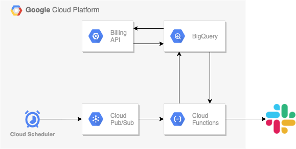
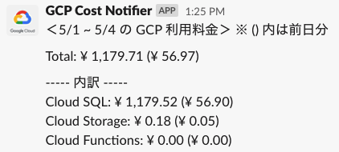

# gcp-cost-notification

Send notification to Slack on GCP costs.






This system uses

- Cloud Billing
- BigQuery
- Cloud Scheduler
- Pub/Sub
- Google Cloud Functions
- Slack API

## Prerequisites

- [Export Cloud Billing data to BigQuery](https://cloud.google.com/billing/docs/how-to/export-data-bigquery-setup)
- [Create Pub/Sub topic](https://cloud.google.com/pubsub/docs/quickstart-console)
- [Set Cloud Scheduler](https://cloud.google.com/scheduler/docs/quickstart)
- [Make Slack app and get Incoming Webhook URI](https://api.slack.com/messaging/webhooks)

## Enviroment Variables

Enviroment variables to use in GCF runtime are set in `env.yaml` file.

(sample)
```yaml
GCP_PROJECT: <your GCP poject-id>
DATASET_NAME: <BQ dataset name>
TABLE_NAME: <BQ table name>
SLACK_WEBHOOK_URL: <slack webhook url>
FILE_DIRECTORY: "serverless_function_source_code/" # this should be fixed
TIMEZONE: <Your TimeZone. e.g. Asia/Tokyo>
```

## Test Commands

Before executing test commands, environment variables must be set in `.env` file.

### Unit Tests (short mode)

Execute unit tests which have no interaction with outer services (BigQuery and Slack).

```sh
make test
```

### All Tests (including BigQuery and Slack communication)

```sh
make test-all
```

### Local Runner

Run the whole process from your local environment.

```sh
make local-run
```

## Deploy Command

Set `REGION` and `TRIGGER_TOPIC` variables in Makefile and execute this command:

```sh
make deploy
```